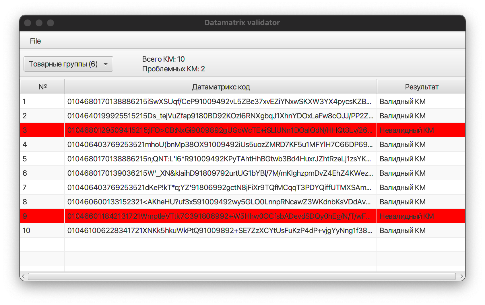

# Утилита валидации датаматрикс кодов

Реализована с использованием JavaFX и [библиотеки валидации даматрикс кодов](https://github.com/lamoda/datamatrix-validator).



Сборка под конкретную платформу:
```
mvn clean install -Djavafx.platform=win|mac 
mvn javafx:run
```
